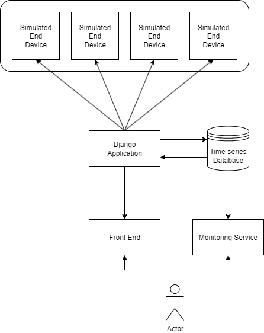

# [Django-Resource-Monitor](https://github.com/adammcw01/Django-Resource-Monitor)

This project is a technical exercise completed in part as an application for a role in Network Reliability Engineering.
The goal is to create a self-service dashboard to monitor a collection of networked devices. Enabling teams to quickly monitor the health of the network.

---
Throughout this project I will demonstrate my approach towards the solution, occasionally offering alternative approaches when applicable.

## How To Deploy

There are two ways of running this solution.

1. If Docker is installed you can run the docker compose file to handle everything.
2. The API and webserver can be run independnetly.

### Prerequisites (How to Setup)

To run this solution using docker please install the engine from [docker.com](https://www.docker.com/)

1. If running locally make sure you have python installed
2. Create a virtual environment by running
`python -m venv venv`
3. Activate it by runnning `venv\Scripts\activate`
4. Install dependencies by running `pip install -r requirements.txt`

### Starting The Application

To run the app using docker compose, ensure the docker daemon is running.
Open a command prompt at this location and run `docker-compose up --build`

1. Run `python -m api.app.app -d 16` to start the API to generate data. *The-d 16 creates 16 devices.*
2. Run `python resourcemonitor/manage.py runserver 80` to start the Django Web app.
3. Once started navigate to [127.0.0.1](http://127.0.0.1)

### Testing The Application

Testing can only be run locally using python unittest.
For full testing history please visit [github](https://github.com/adammcw01/Django-Resource-Monitor/actions)

1. Open a command prompt here
2. Run `cd api` and then `pytest` to generate a test report for the Flaks API.
3. Run cd into `Django-Resource-Monitor\resourcemonitor` and then `pytest` to generate a test report for the Django backend.

## Initial Approach And Understanding

The project has 5 clearly outlined deliverables.

1. A Django backend web app to serve a single page to the user.
2. Create an API to fetch the status' of devices on the network.
3. A simple user interface to allow users to quickly identify issues.
4. The project should be organised in  a professional manner.
5. Functional unit-testing written in pytest.

---
From this I have identified some additional functionality that I believe could improve this system (Nice to haves).

* Additional traceability for the health of the systems itself.
  * Each component should generate logs.
  * These logs should be stored in a suitable time-series database.
  * An administrator should be able to generate metrics from these logs.
* In addition to being able to quickly see the status of each device, the user should be able to generate metrics for the devices to ensure the SLOs are being met.
* The system should be flexible enough to handle a scaling number of devices.
* Different components of the system should be able to operate independently to ensure availability.

### Initial Architecture Diagram

---

### Additional Thoughts

---

#### Simulated End Devices (API)

* In this solution I have developed a flask application to act as an end device, sending status updates to the main Django app.
* An alternative could be MQTT in python via paho. This could be a better soltuion as it behaves more like a real network device. However it would require a broker which is beyond the scope of this project.

#### Database Options

I believe the follow would all be considered good tools for storing the systems logs.

* PostgreSQL (timescaleDB extension) - Commonly used and easy to maintain.
* InfluxDB - Very efficient for large scale time series data.
* Prometheus - Easy setup and high compatability with visualisation tools.
* SQLite - Compatible with Django by default. Minimal setup required.
